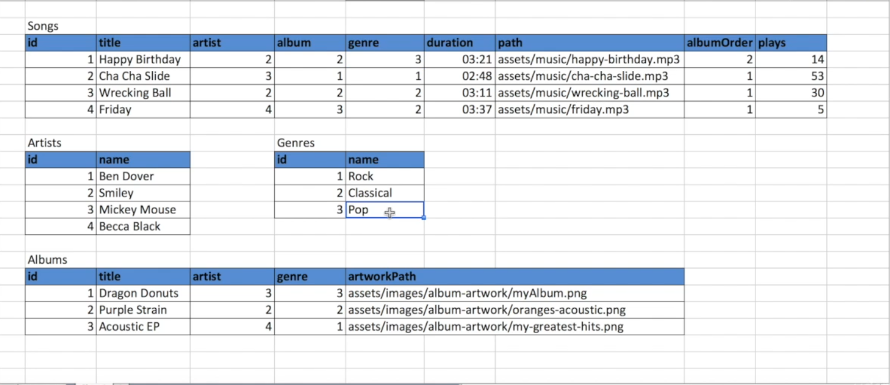

<!-- ABOUT THE PROJECT -->
## About The Project

##Slotify

##INSTALLATION
Install Xampp and then start the apache and mysql server 

Make sure to turn on the cookies in the brwser settings 

Login and Register 

Table structure for the project

