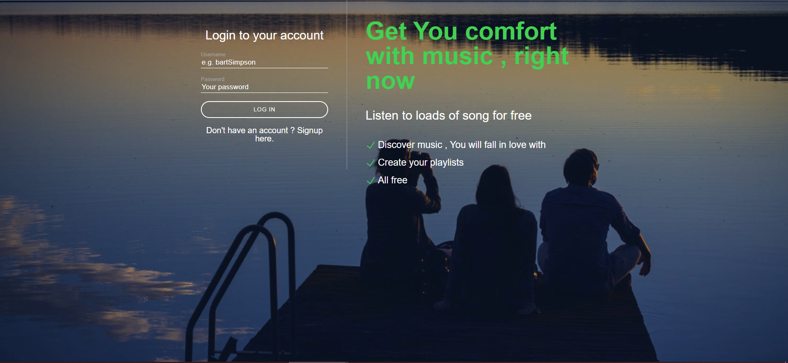

<!-- ABOUT THE PROJECT -->
## About The Project

##Slotify

##INSTALLATION
Install Xampp and then start the apache and mysql server 

Make sure to turn on the cookies in the browser settings 

Login and Register 

Table structure for the project

User Album

Current Album

